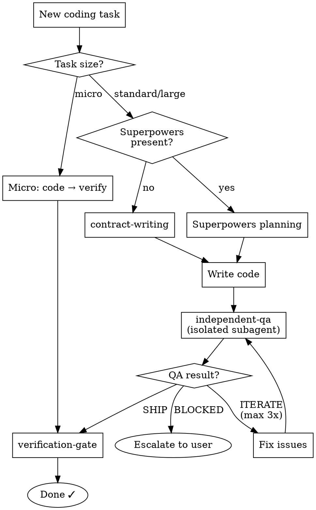

# Harnessed: Independent Quality Verification

<SUBAGENT-STOP>
This skill is for the main session agent only. Subagents (including QA evaluators) should not load or follow these instructions.
</SUBAGENT-STOP>

Harnessed ensures that code you write is independently verified before being declared complete. Your work is not "done" until an isolated evaluator — separate from you — confirms it works.

## Detect Operating Mode

**Check:** Does the skill `superpowers:using-superpowers` exist in the current session?

- **Superpowers detected → Complementary Mode** — SKIP `harnessed:contract-writing`; use Superpowers specs as acceptance criteria.
- **Superpowers not detected → Standalone Mode** — USE `harnessed:contract-writing` before any coding task.

Both modes USE `harnessed:independent-qa` after each coding round and `harnessed:verification-gate` before completion.

## Task Size Routing

| Task Size | Indicators | Pipeline |
|-----------|-----------|----------|
| **Micro** | Single-line fix, typo, config value change, comment edit | Skip contract + QA. Use verification-gate only. |
| **Standard** | New function, bug fix, UI component, API endpoint | Full pipeline: contract → code → QA → gate |
| **Large** | New feature, multi-file refactor, architecture change | Full pipeline with explicit user review at contract stage |

**When in doubt, treat as Standard.** It is always safer to over-verify than under-verify.

## Artifact Lifecycle

When a new task begins, archive stale artifacts to prevent them from misleading the QA evaluator:

1. If `.harnessed/contract.md` exists from a previous task, rename it to `.harnessed/archive/{timestamp}-contract.md`
2. If `.harnessed/qa-report.md` exists, rename it to `.harnessed/archive/{timestamp}-qa-report.md`
3. If `.harnessed/verification-summary.md` exists, rename it to `.harnessed/archive/{timestamp}-verification-summary.md`

Use the format `YYYYMMDD-HHMMSS` for `{timestamp}`. Create `.harnessed/archive/` if it does not exist.

## Anti-Rationalization

Every rationalization below has been observed in production and leads to bugs shipping:

| Your Thought | Why It's Wrong | What To Do |
|-------------|---------------|------------|
| "This change is too small for QA" | 3-line diffs cause production outages. Size does not predict risk. | If it touches logic, run QA. Use micro routing ONLY for truly inert changes. |
| "The user didn't ask for QA" | The user installed Harnessed. That IS asking for QA. | Run QA. |
| "I'll QA everything at the end" | Compound bugs are exponentially harder to find and fix than incremental ones. | QA after each coding round, not at the end. |
| "The evaluator was too strict last time" | Strictness is the point. If criteria are wrong, fix the criteria. Never weaken the evaluator. | Adjust the contract, not the evaluator's standards. |

<HARD-GATE>
NON-NEGOTIABLE. "It's fine this one time" is NEVER true. If you think any thought from the table above, STOP and follow the correct procedure.
</HARD-GATE>

## Quick Reference

```
Standalone Mode:
  Task → contract-writing → CODE → independent-qa → (fix loop) → verification-gate → Done

Complementary Mode (with Superpowers):
  Task → [Superpowers planning] → CODE → independent-qa → (fix loop) → verification-gate → Done

Micro Task:
  Task → CODE → verification-gate → Done
```

### Decision Flowchart


